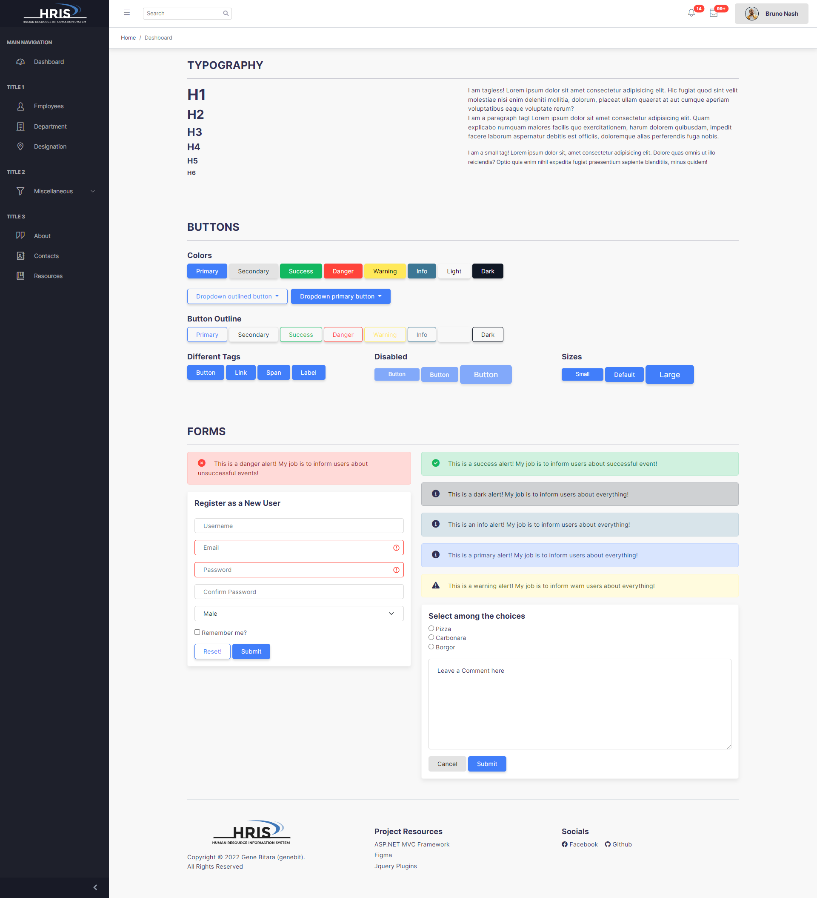
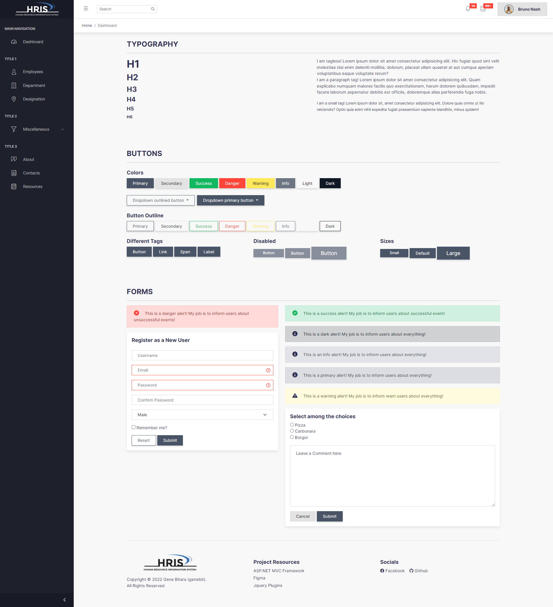

### Custom Core UI + Bootstrap CSS Framework

Combining Core UI admin page layout with Bootstrap's v5 styles with the ability to easily customize styles using SASS.

### Presets

Grab one through the branch

Default             |  Prototype
:-------------------------:|:-------------------------:
  |  

### How to use

* Clone this project from the `build` branch or download it from release.
* Move this repository to your project.
* Include to HTML header tags.

### What to include in the header tags

```html
<!-- Vendors styles (optional if using sidebar) -->
<link rel="stylesheet" href="path/plugins/simplebar/dist/simplebar.css" />

<!-- Main styles -->
<link rel="stylesheet" href="path/css/bs-coreui.css" />

<!-- Icons: Fontawesome 6 and CoreUI (both are optional) -->
<link rel="stylesheet" href="path/font-awesome/6.1.1/css/all.min.css" />
<link rel="stylesheet" href="path/plugins/coreui-comp/icons/css/all.min.css" />

<!-- Jquery -->
<script src="path/plugins/jquery/dist/jquery.min.js"></script>

<!-- Popper JS -->
<script defer src="path/plugins/popperjs/core/dist/umd/popper.min.js"></script>

<!-- Core UI Scripts -->
<script defer src="path/plugins/coreui-comp/coreui/dist/js/coreui.bundle.js"></script>
<script defer src="path/plugins/simplebar/dist/simplebar.min.js"></script>
<script defer src="path/plugins/coreui-comp/utils/dist/coreui-utils.js"></script>

<!-- Bootstrap 5 -->
<script defer src="path/plugins/bootstrap/dist/js/bootstrap.min.js"></script>

<script defer src="path/js/site.js"></script>
<style>
    /* Insert your personal site font here */
    @import url("https://fonts.googleapis.com/css2?family=Inter:wght@100;200;300;400;500;600;700;800;900&display=swap");
    * {
        font-family: "Inter", sans-serif;
    }
</style>
```

### Customizing BS5

**Prerequisites**

- SASS Compiler or just use the watch SASS compiler in VSCode.

Go to `src/scss` and modify `bs-coreui.scss`.
Once you are done with your customization build the sass file to css and minify to `build/`